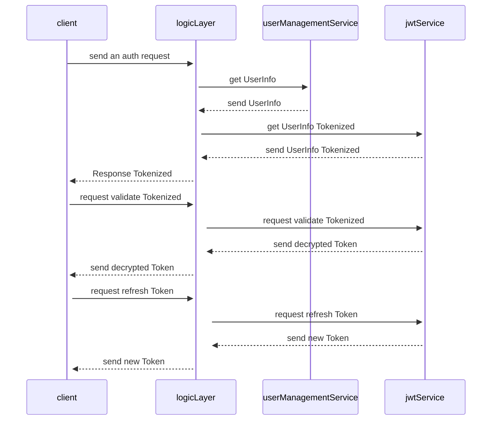

```mermaid
sequenceDiagram

    client ->>+ logicLayer: send an auth request
    logicLayer ->>+ userManagementService: get UserInfo
    userManagementService -->>+ logicLayer: send UserInfo
    logicLayer ->>+ jwtService: get UserInfo Tokenized
    jwtService -->>+ logicLayer: send UserInfo Tokenized
    logicLayer -->>+ client: Response Tokenized

    client ->>+ logicLayer: request validate Tokenized
    logicLayer ->>+ jwtService: request validate Tokenized
    jwtService -->>+ logicLayer: send decrypted Token
    logicLayer -->>+ client: send decrypted Token

    client ->>+ logicLayer: request refresh Token
    logicLayer ->>+ jwtService: request refresh Token
    jwtService -->>+ logicLayer: send new Token
    logicLayer -->>+ client: send new Token
```
